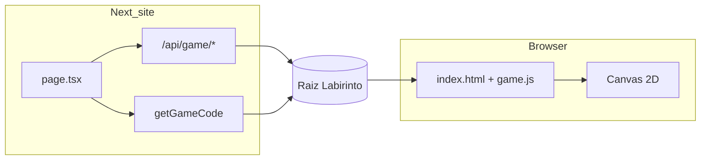

# Pixel Maze — Documentação do Projeto

Labirinto procedural em pixel art com motor em **Canvas 2D** (`game.js`) e site institucional em **Next.js** (`website/`). O repositório é um **monorepo**: o jogo vive na raiz; o site expõe, documenta e integra o mesmo código sem duplicar a lógica do motor.

---

## Sumário

1. [Visão geral](#visão-geral)
2. [Estrutura do repositório](#estrutura-do-repositório)
3. [Funcionalidades](#funcionalidades)
4. [Motor do jogo (`game.js`)](#motor-do-jogo-gamejs)
5. [Site (`website/` em Next.js)](#site-website-em-nextjs)
6. [Como executar](#como-executar)
7. [Equipe](#equipe)

---

## Visão geral

| Camada | Tecnologia | Papel |
|--------|------------|--------|
| **Jogo** | HTML5 Canvas, JavaScript vanilla | Gameplay, geração de mapa, física, render |
| **Site** | Next.js 16, React 19, Tailwind CSS 4, GSAP | Landing, documentação visual, proxy do jogo, página da equipe |
| **Assets** | PNG (sprites pixel art) | Muro, grama, personagem, portões |

O jogador percorre um labirinto gerado por **Kruskal aleatorizado**, com **timer** que regenera o mapa (mutação) e quatro **níveis de dificuldade**. O modo **Impossível** adiciona **visão limitada** (fog of war).

---

## Estrutura do repositório

```
Labirinto/
├── index.html          # Shell do jogo (menu, HUD, canvas)
├── game.js             # Motor completo do jogo
├── style.css           # Estilos pixel/retro do jogo
├── Sprites/            # Arte do jogo (muro, grama, persona, portões)
├── PROJETO.md          # Este documento
└── website/            # Aplicação Next.js
    ├── src/
    │   ├── app/
    │   │   ├── page.tsx              # Home (marketing + código ao vivo)
    │   │   ├── desenvolvedores/      # Página da equipe
    │   │   ├── actions.ts            # Server Action: lê game.js
    │   │   └── api/game/[...slug]/   # Serve index.html, game.js, Sprites/
    │   ├── components/               # UI React (cards, hero, cursor, etc.)
    │   └── lib/
    │       ├── getLabirintoRoot.ts   # Resolve pasta do jogo no mono-repo
    │       ├── mazeKruskalPreview.ts # Preview Kruskal para cards de nível
    │       └── developers.ts         # Dados da equipe
    └── public/                       # Fotos da equipe, vídeos de demo
```

---

## Funcionalidades

### Jogo (`index.html` + `game.js`)

| Funcionalidade | Descrição |
|----------------|-----------|
| **Menu e níveis** | Seleção entre Fácil, Médio, Difícil e Impossível (`CONFIG`: tamanho da grelha + tempo até mutação). |
| **Geração procedural** | Novo labirinto a cada partida e a cada mutação via Kruskal + Union-Find. |
| **Movimento contínuo** | WASD/setas; velocidade com `dt`; deslize ao soltar tecla. |
| **Colisão AABB** | Hitbox menor que o tile; resolução por eixo (desliza em cantos). |
| **Timer e mutação** | Ao zerar o tempo: novo mapa, reset do jogador, animação (~1,5 s) com shake e queda das paredes. |
| **Countdown final** | Últimos 5 segundos: overlay dramático com aviso “MUDANÇA!”. |
| **Modo Impossível** | Mesma grelha que Difícil; mapa visível só em círculos de luz (jogador, entrada, saída). |
| **Vitória** | Chegar ao tile de saída dentro de um raio de tolerância. |
| **Internacionalização** | PT/EN conforme `lang` do HTML ou idioma do navegador. |
| **Query string** | `?difficulty=hard` pré-seleciona o nível no menu. |
| **Fullscreen** | Botão no HUD; redimensiona o canvas automaticamente. |
| **Pixel art** | Sprites sem suavização (`imageSmoothingEnabled = false`). |

### Site (`website/`)

| Funcionalidade | Descrição |
|----------------|-----------|
| **Landing** | Hero com vídeo, typewriter, grid interativo e CTAs (jogar, arquitetura, níveis, equipe). |
| **Código ao vivo** | Bloco que exibe o conteúdo real de `game.js` via Server Action. |
| **Cards de níveis** | Mini-labirintos gerados com o mesmo algoritmo Kruskal (seed fixa) em canvas. |
| **Demo em vídeo** | Gameplay embutido na home. |
| **Jogo integrado** | Link `/api/game/index.html` serve o jogo da raiz do mono-repo. |
| **Página Desenvolvedores** | `/desenvolvedores` — equipe com cards 3D (GSAP) e fotos. |
| **Cursor customizado** | Sprite pixel-art seguindo o mouse (estética alinhada ao jogo). |

---

## Motor do jogo (`game.js`)

### Por que JavaScript vanilla no Canvas, sem engine (Phaser, Unity Web, etc.)?

- **Transparência pedagógica**: um único arquivo (~900 linhas) concentra loop, mapa, física e desenho — fácil de explicar em apresentação acadêmica.
- **Zero dependências de runtime**: abre com `index.html` + script; deploy simples.
- **Controle total**: geração de labirinto, colisão e fog of war implementados de propósito, sem camadas ocultas de framework.
- **Performance adequada**: grelha até 35×35 e dezenas de sprites; Canvas 2D é suficiente.

### Por que Kruskal (e não DFS puro)?

- Produz labirinto **perfeito** (árvore): sempre existe **um** caminho da entrada à saída.
- Arestas **embaralhadas** antes do Union-Find geram becos e bifurcações mais **uniformes** que DFS, que tende a corredores longos.
- Complexidade aceitável; roda só no início da partida e na mutação, não a cada frame.

### Por que Union-Find?

- Kruskal precisa saber se duas células já estão na mesma componente antes de remover uma parede.
- `find` com path compression e `union` garantem quase O(1) amortizado por operação.

### Por que movimento em coordenadas contínuas + colisão por eixo?

- Posição fracionária (`player.x`, `player.y` como centro do tile) dá sensação fluida.
- Separar movimento em X e depois Y evita **travar em cantos** de parede — padrão clássico de top-down 2D.
- Hitbox (`PLAYER_HALF_TILE`) menor que o sprite visual melhora passagem em corredores de 1 tile.

### Por que delta time (`dt`)?

- `update(dt)` e `timeLeft -= dt` tornam velocidade e cronômetro **independentes do FPS** (60 Hz, 144 Hz, mobile).

### Por que mutação em vez de mapa fixo?

- Reforça o tema **“labirinto mutante”**: pressão de tempo + necessidade de reler o mapa.
- Reutiliza `generateMaze()` sem lógica extra; animação (`isMutating`) pausa regras durante a transição visual.

### Por que buffer offscreen no modo Impossível?

- Desenha o mundo completo uma vez em `visionBuffer`, depois aplica `clip()` com círculos de luz no canvas principal.
- Reaproveita `drawGrassLayer` e `drawGameplayLayer` sem reescrever o pipeline de tiles.

### Por que estado global `state` e `requestAnimationFrame`?

- Jogo single-page sem roteamento; um objeto `state` centraliza modo, mapa, jogador e timer.
- `gameLoop` só roda em `mode === 'playing'`, economizando CPU no menu/vitória.

### Representação do mapa

```text
state.map[y][x] === 1  →  parede
state.map[y][x] === 0  →  corredor (grama)
```

Entrada e saída são fixadas após o Kruskal, com tiles extras abertos nas bordas para o jogador entrar e sair visualmente.

### Níveis (`CONFIG`)

| Nível | Grelha | Tempo até mutação | Observação |
|-------|--------|-------------------|------------|
| `easy` | 15×15 | 4 min | Aprendizado de controles |
| `medium` | 25×25 | 3 min | Mais densidade de decisões |
| `hard` | 35×35 | 1 min 45 s | Mapa grande, pressão alta |
| `impossible` | 35×35 | 2 min | + fog of war (visão curta) |

---

## Site (`website/` em Next.js)

### Por que Next.js e não só HTML estático?

| Motivo | Benefício no projeto |
|--------|----------------------|
| **App Router + React** | Home rica em seções (hero, features, níveis, código, demo) com componentes reutilizáveis. |
| **Server Actions** | `getGameCode()` lê `game.js` do disco no servidor — o site mostra o **código real**, não uma cópia manual. |
| **Route Handlers** | `/api/game/[...slug]` serve o jogo e sprites com MIME correto e validação de path. |
| **TypeScript** | Tipagem em previews de labirinto, API e dados da equipe. |
| **Deploy** | Fluxo maduro (ex.: Vercel) para site + variáveis de ambiente; mono-repo continua com jogo na raiz. |
| **Evolução** | Páginas como `/desenvolvedores` e animações GSAP sem reescrever o motor em React. |

### Por que não embutir o jogo como componente React?

- O motor foi pensado como **Canvas vanilla** (loop, sprites, colisão). Mantê-lo em `game.js` evita hidratação, refs complexos e duplicação de lógica.
- O site faz **integração por proxy**: mesma fonte da verdade na raiz do repositório.

### Integração mono-repo

1. **`getLabirintoRoot()`** — Procura `index.html` e `game.js` em candidatos (`../`, `Labirinto/`, `cwd`) para funcionar com `npm run dev` dentro de `website/` ou na raiz.
2. **`/api/game/[...slug]`** — Lê arquivos do jogo; `isPathInsideLabirintoRoot()` bloqueia path traversal (`../`).
3. **`getGameCode()`** — Server Action que expõe `game.js` na home para documentação técnica.

### Preview de labirinto no site

`mazeKruskalPreview.ts` replica o algoritmo de `generateMaze()` com **PRNG determinístico** (Mulberry32 + seed por nível). Os cards na home mostram a **topologia típica** de cada dificuldade sem precisar rodar o jogo.

### Stack do site

- **Next.js 16** · **React 19** · **Tailwind CSS 4**
- **GSAP** — animações de entrada e fundo 3D na página de desenvolvedores
- **lucide-react** — ícones da interface

---

## Como executar

### Jogo (standalone)

Abra `index.html` com um servidor local (evita bloqueio de CORS em sprites), por exemplo:

```bash
# Na raiz do repositório
npx serve .
# ou
python -m http.server 8080
```

Acesse `http://localhost:8080` (ou a porta usada).

### Site Next.js

```bash
cd website
npm install
npm run dev
```

- **Home:** [http://localhost:3000](http://localhost:3000)
- **Jogo via proxy:** [http://localhost:3000/api/game/index.html](http://localhost:3000/api/game/index.html)
- **Equipe:** [http://localhost:3000/desenvolvedores](http://localhost:3000/desenvolvedores)

Build de produção:

```bash
cd website
npm run build
npm start
```

> Em deploy, garanta que a pasta raiz do jogo (`index.html`, `game.js`, `Sprites/`) esteja acessível para `getLabirintoRoot()` — normalmente mantendo a estrutura do mono-repo no servidor.

---

## Equipe

A página **`/desenvolvedores`** apresenta os integrantes, papéis e fotos. Os dados ficam em `website/src/lib/developers.ts`.

| Integrante | Foco (documentado no site) |
|------------|----------------------------|
| Boni | Engine & gameplay |
| Fernando | Frontend & UI (site) |
| Henrique | Systems & build (API, mono-repo) |
| Regio | Level design & dificuldades |
| Thiago | Visual & pixel art |

---

## Fluxo resumido (dados)



---

## Referências rápidas de arquivos

| Arquivo | Responsabilidade |
|---------|------------------|
| `game.js` | Loop, Kruskal, física, colisão, timer, mutação, render, modo impossível |
| `index.html` | Estrutura DOM: canvas, menu, HUD, vitória |
| `website/src/app/api/game/[...slug]/route.ts` | Proxy seguro dos arquivos do jogo |
| `website/src/lib/getLabirintoRoot.ts` | Resolução do path do mono-repo |
| `website/src/lib/mazeKruskalPreview.ts` | Preview determinístico para a home |
| `website/src/app/actions.ts` | Leitura de `game.js` para exibição no site |

---

*Pixel Maze — projeto acadêmico FEI. Motor em Canvas; vitrine em Next.js.*
